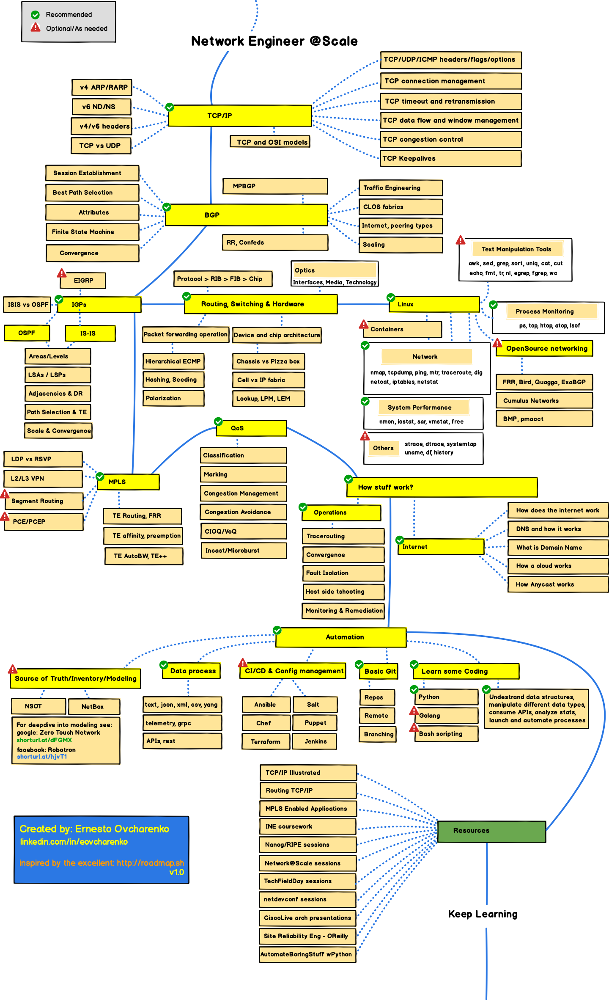

# neteng roadmap/landscape
Network Engineering at Scale Roadmap/Landscape

The intention of this document is to:
- Describe the landscape of different knowledge areas that are critical for a network engineer in a large scale environment.
- Provide a roadmap for those seeking to learn or enhance their knowledge in the network engineering field.

Please note that this is *NOT* an exhaustive blueprint and as such you must adapt and optimize it to your particular usecase.

