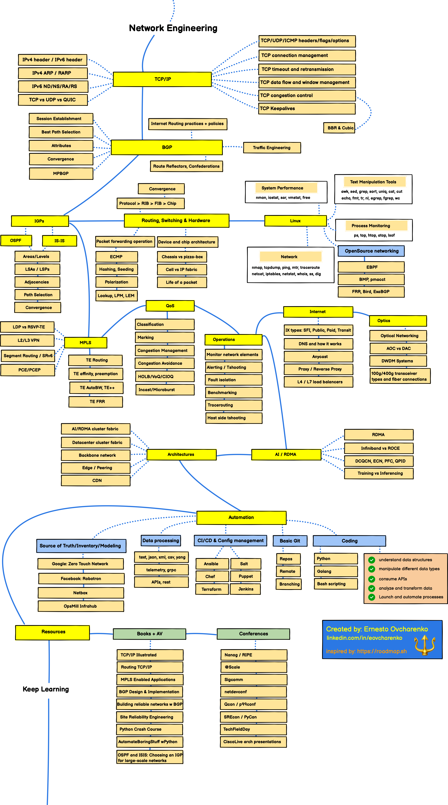

# Network Engineering at Scale Roadmap/Landscape

The purpose of this roadmap is to give you an idea of the landscape of network engineering in a large scale environment, including different knowledge areas that might be interesting for you to explore and topics to learn next. 

Please note that this is NOT an exhaustive blueprint and as such you must adapt and optimize it to your particular usecase or area of interest.

**Note to Beginners** (*and experienced engineers as well*)

This roadmap covers a lot of information and most areas can be a specialty by itself! Don't feel overwhelmed, you don't need to learn it all!

If you think that this can be improved in any way, your feedback is welcome, please submit a Github issue.

